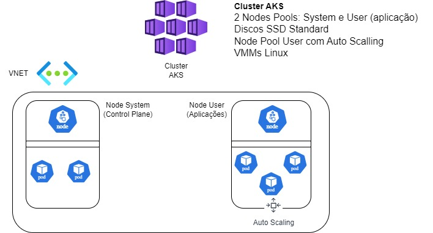

## Terraform-AKS-1Node_System-1NodePoll_AutoScalling
Cluster AKS com 1 NodePool System e 1 NodePool User com AutoScaling

## Terraform-AKS-1node_pool <h1>
Cluster AKS com 1 NodePool System (Control Plane AKS) + 1 NodePool User com AutoScaling (VMMs) Linux.

Este projeto implementa um cluster AKS no Azure usando o Terraform. Esta é uma versão do projeto, onde todos os recursos são definidos usando módulos separados.

##  Visão Geral <h2>
Cluster Kubernetes: Versão estável do AKS.

Node Pool: 1 pool de nós (system) para execução de workloads.
Rede: Configuração de rede padrão (kubenet).

Node Pool: 1 pool de nós (user) para execução das aplicações
Sistema Operacional Linux (AzureLinux)
Alta Escalabilidade: com Mínimo = 1 e Máximo = 3 Nodes dentro do Pool, ajuste do número de nós conforme demanda.
Discos SSD´s Gerenciados

### Configurando Acesso ao Cluster AKS <h3>
### 1. Obtenha as credenciais do cluster
Use o Azure CLI para baixar o kubeconfig:  <i> az aks get-credentials --resource-group rg-aks --name aks-cluster <i> 

### 2. Teste o acesso <h3>
Liste os nós do cluster para confirmar a conexão: <i> kubectl get nodes <i> 

#####
########
###############

